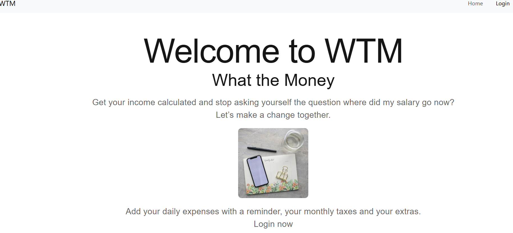
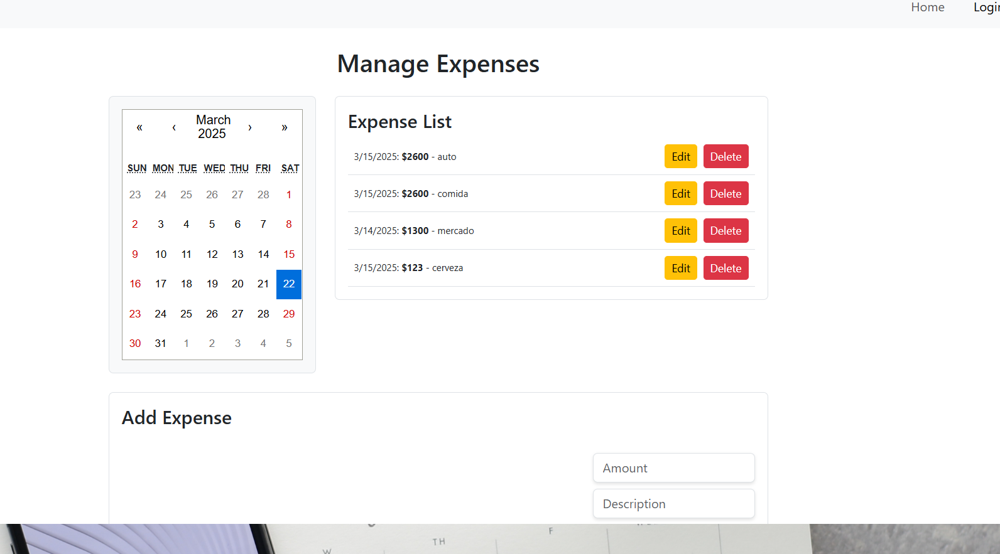

  

  <h1 align="center">🌟 **WTM** 🌟</h1>

  

    What The Money is an app designed to keep the track or your expenses, include taxes
    And keep a better control over your income🛒✨
  

##sample: 

# WHAT THE MONEY #
- Does it ever happen to you that you that :money_with_wings: money flies away and you don't know why?
- Keep track of your expenses!  :dollar:
- Pay on time!!  :calendar:
- Add your daily expenses and keep an eye on where does money goes!  :page_with_curl:
- Help with due dates 	 :email:
- Monitor the "in what?" :chart_with_downwards_trend: 

what the money?? 💶 :euro:

## 📦 **What's included**
### Working with the following technologies: **React**, **Js**, **Bootstrap**, **Css**, **MongoDB**, **Postman**, **NodeJs** ###

## 🚀 **Our project**
- Backend **NodeJs**
- Frontend **React Js**
- Design **Figma**

## 🌟 **Features**
- Navbar
- Login Form
- Register Form
- Services
- Home Page

## Creators

**Antonella** 🛍️🌟👜

- [GitHub Profile](https://github.com/AntoCLus)

## WORK IN PROGRESS

## Copyright and license

Code and documentation copyright 2023 the authors.
